# Smart Reader Architecture

> Last updated: 2026-08-01
> Status: Phase 0-6 complete, Phase 7 (testing) remaining

---

## System Overview

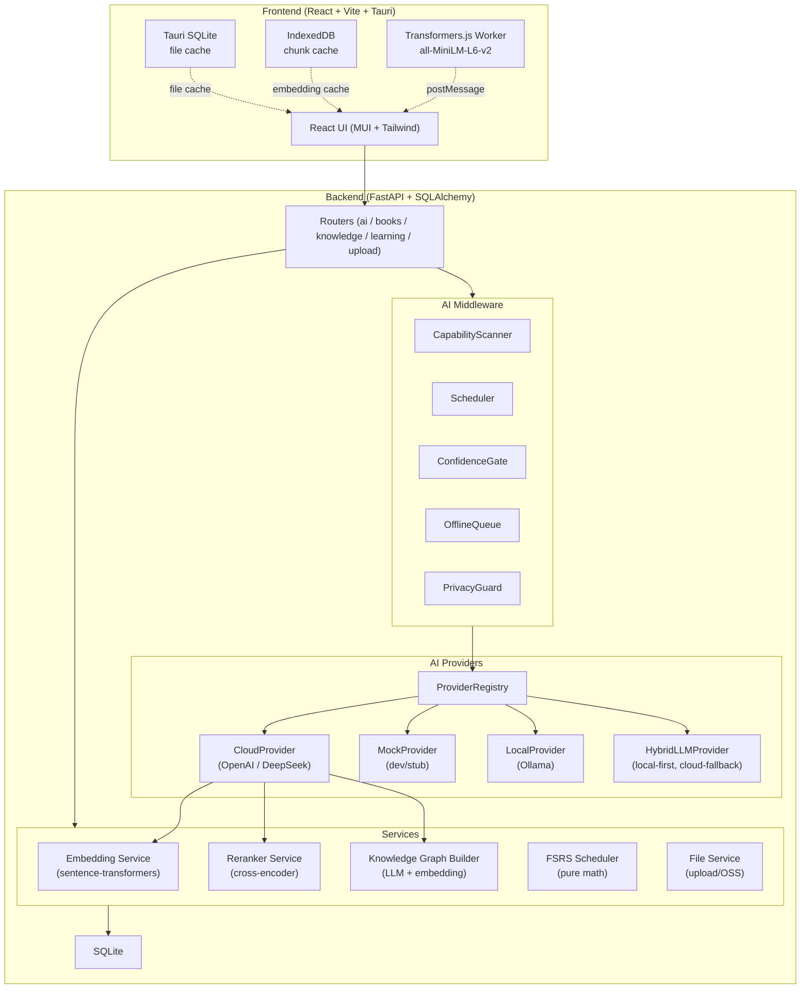

---

## Multi-Layer Architecture

```mermaid
graph TB
    subgraph L1["Layer 1 — User Interface (React + Tauri)"]
        direction LR
        ReaderP["Reader<br/>(PDF / EPUB / Markdown / local file)"]
        LibraryP["Library<br/>(search / groups / share / unshare)"]
        KGP["Knowledge Graph<br/>(canvas + list + detail)"]
        ReviewP["Review<br/>(FSRS flashcards + notes)"]
        SettingsP["Settings<br/>(language / theme / privacy)"]
    end

    subgraph L2["Layer 2 — AI Middleware (FastAPI)"]
        direction LR
        Scanner["CapabilityScanner<br/>Ollama probe, online status"]
        Sched["Scheduler<br/>task → RouteDecision"]
        Gate["ConfidenceGate<br/>confidence < 0.6 → cloud"]
        Queue["OfflineQueue<br/>pending + retry + flush"]
        Guard["Privacy Guard<br/>X-Privacy-Mode → 403 cloud"]
    end

    subgraph L3["Layer 3 — Provider Abstraction"]
        direction LR
        AIFace["interface AIProvider"]
        CloudP["CloudProvider<br/>(OpenAI / DeepSeek API)"]
        LocalP["LocalProvider<br/>(Ollama REST)"]
        MockP["MockProvider<br/>(dev stub + KP mock)"]
        HybridP["HybridLLMProvider<br/>(local-first → cloud fallback)"]
        Registry["ProviderRegistry<br/>(singleton, startup init)"]
    end

    subgraph L4["Layer 4 — AI Services"]
        direction LR
        EmbedSvc["Embedding<br/>sentence-transformers<br/>all-MiniLM-L6-v2 (384d)"]
        RerankSvc["Reranker<br/>cross-encoder<br/>ms-marco-MiniLM-L-6-v2"]
        RetrievalSvc["HybridRetriever<br/>BM25(0.3) + Vector(0.7)"]
        KGSvc["Knowledge Extraction<br/>LLM batch extract + relate"]
        FSRSSvc["FSRS Scheduler<br/>pure math, zero network"]
        FileSvc["File Service<br/>upload / OSS / cache"]
    end

    subgraph L5["Layer 5 — Storage"]
        direction LR
        SQLiteS["SQLite (server)<br/>books, chunks, users, shares"]
        IDB["IndexedDB (browser)<br/>chunk embedding cache"]
        TauriDB["Tauri SQLite (desktop)<br/>file blob cache"]
        OSS["Object Storage<br/>local / S3 / Aliyun OSS"]
    end

    L1 --> L2
    L2 --> L3
    L3 --> L4
    L4 --> L5
```

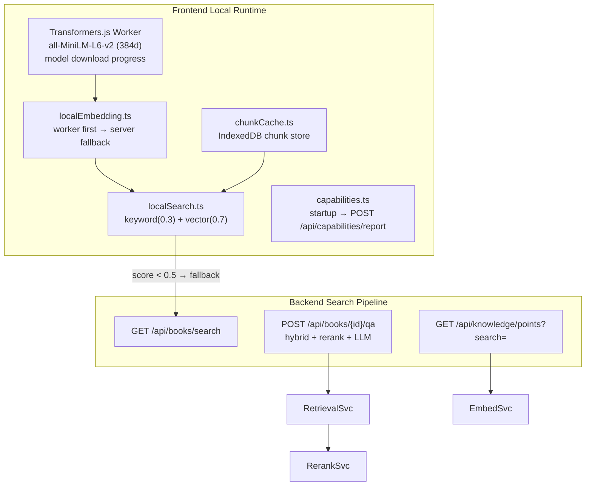

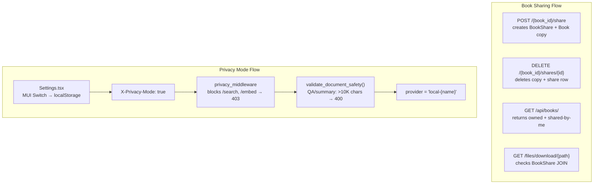

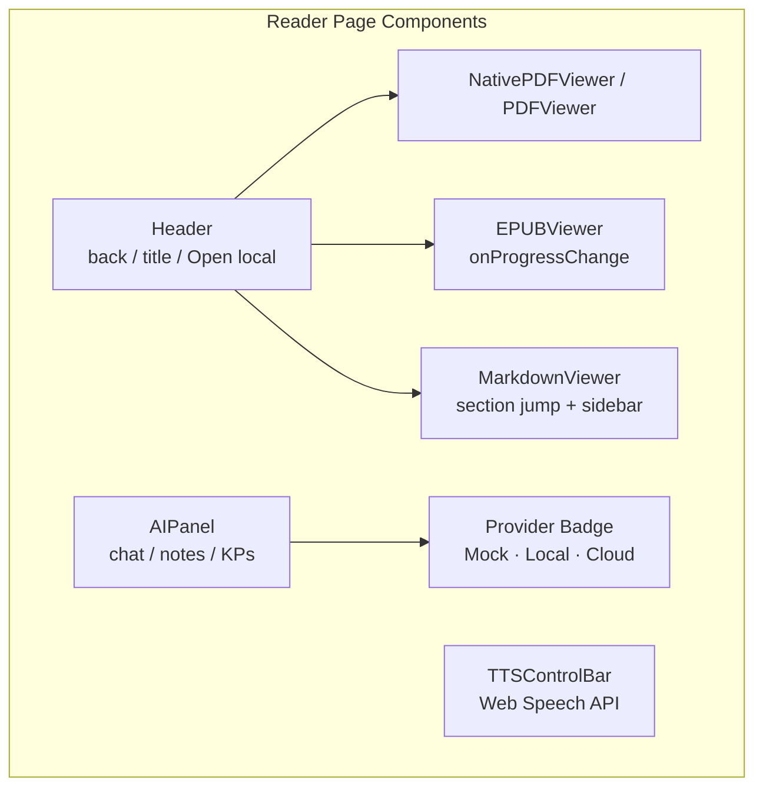

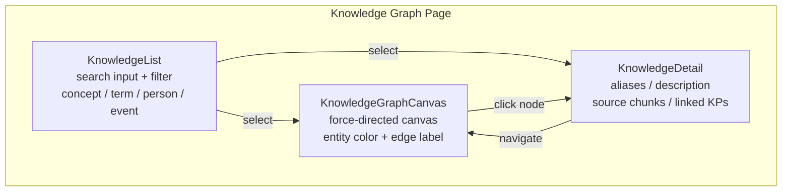

---

## Search Pipeline

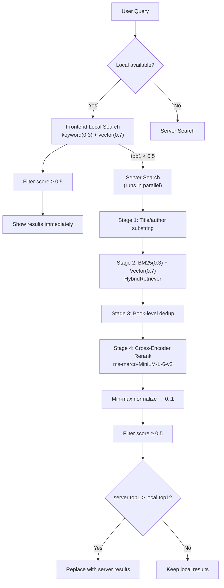

---

## AI Provider Routing

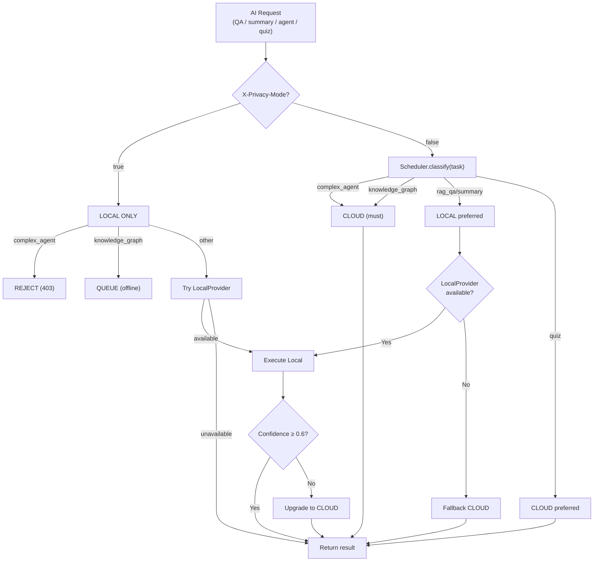

---

## Data Flow: Book Sharing

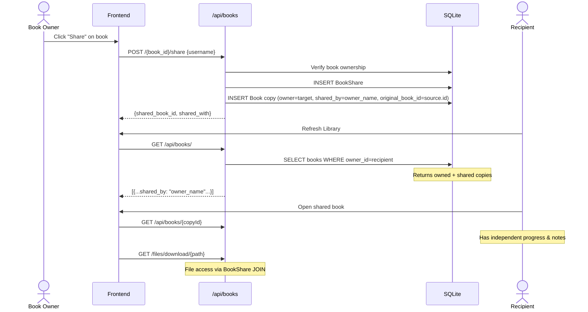

---

## Embedding & Local Search Architecture

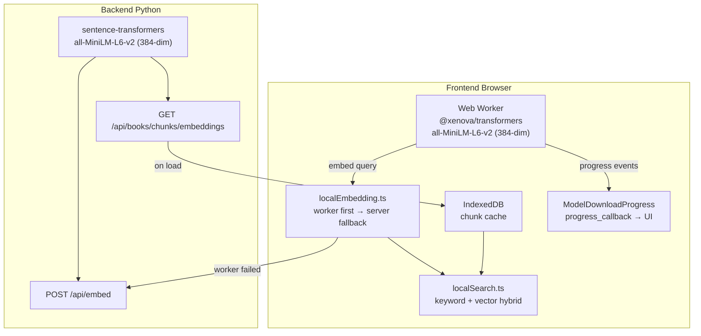

---

## Component Tree

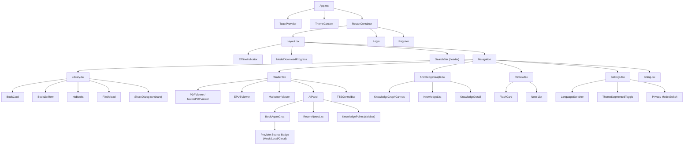

---

## Database Schema (Key Tables)

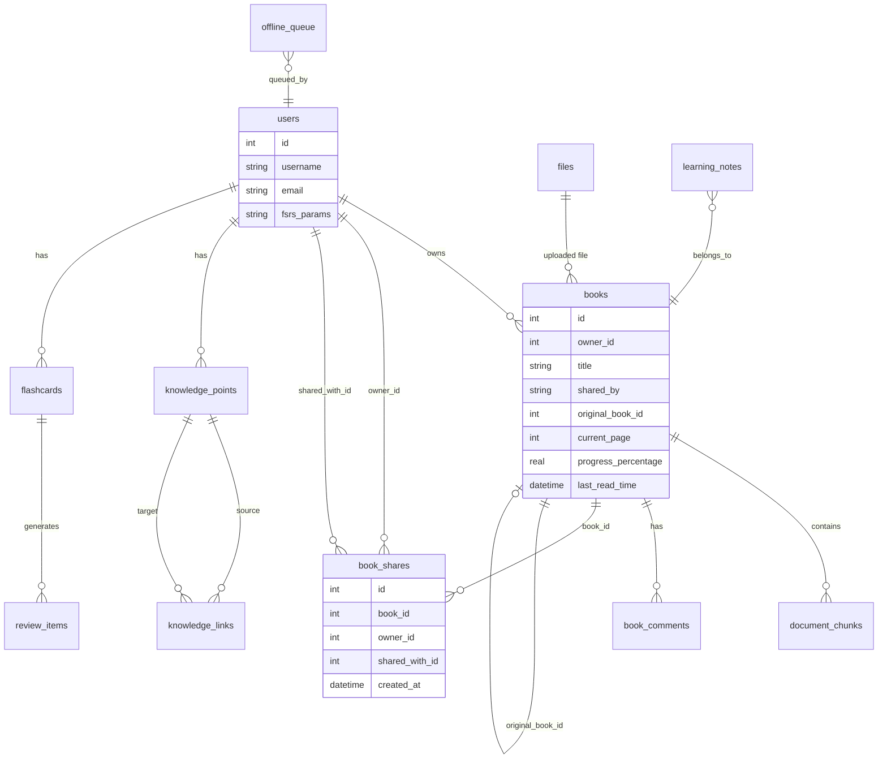

---

## Key Design Rules

| Rule | Implementation |
|------|---------------|
| **Never send document text to cloud in privacy mode** | `PrivacyGuard` middleware returns 403 for `/api/books/search`, `/api/embed` when `X-Privacy-Mode: true`; `validate_document_safety()` blocks >10K char context in QA/summary |
| **Local providers must NOT block the UI** | Transformers.js runs in Web Worker; Ollama calls handled server-side |
| **Storage dual-path** | Desktop (Tauri): SQLite file cache; Browser: IndexedDB chunk cache + file cache |
| **User always knows the source** | AI reply shows "Mock" / "Local" / "Cloud" badge via `BookAgentChat` provider tag |
| **Search quality** | 4-stage pipeline: Title match → BM25+Vector hybrid → Book dedup → Cross-encoder rerank → Score threshold 0.5 |
| **Book sharing with independent copies** | Shared user gets own Book row with `shared_by` + `original_book_id`; independent progress/notes; original owner's file shared via BookShare JOIN |
