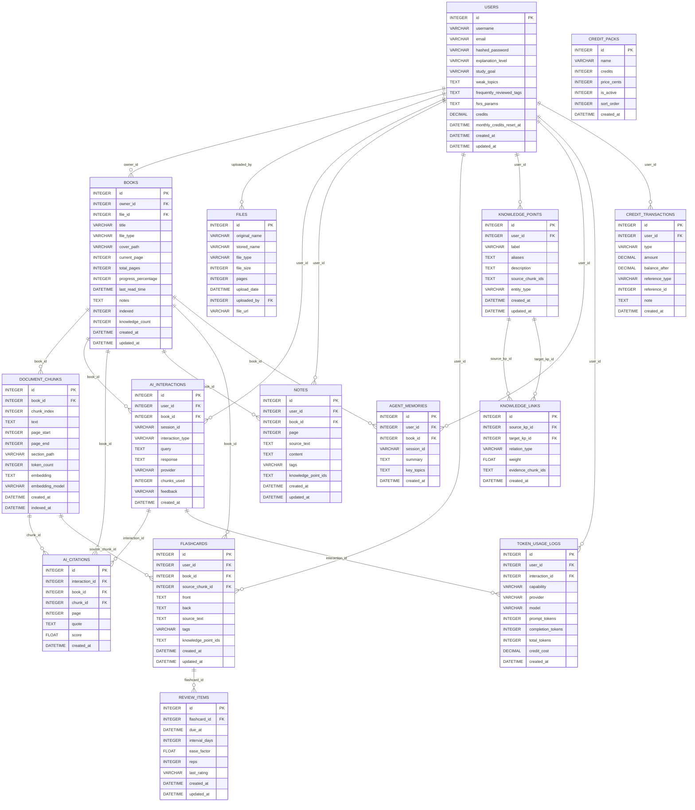

# Smart Reader DB Relationship Map

Last updated: 2026-07-23
Database: `backend/smart_reader.db` (SQLite)
ORM: SQLAlchemy + Alembic migrations

## Tables
- `users`
- `books`
- `files`
- `document_chunks`
- `ai_interactions`
- `ai_citations`
- `notes`
- `flashcards`
- `review_items`
- `knowledge_points`
- `knowledge_links`
- `agent_memories`
- `token_usage_logs`
- `credit_transactions`
- `credit_packs`
- `alembic_version` (migration metadata)

## Entity Relationship Diagram (High-Level)

## Foreign Key Detail (from live DB)

### `ai_citations`
- `chunk_id -> document_chunks.id` (on_delete=CASCADE)
- `book_id -> books.id` (on_delete=CASCADE)
- `interaction_id -> ai_interactions.id` (on_delete=CASCADE)

### `ai_interactions`
- `user_id -> users.id` (on_delete=CASCADE)
- `book_id -> books.id` (on_delete=CASCADE)

### `agent_memories`
- `user_id -> users.id` (on_delete=CASCADE)
- `book_id -> books.id` (on_delete=CASCADE)

### `books`
- `owner_id -> users.id` (on_delete=NO ACTION)
- `file_id -> files.id` (optional, nullable)

### `credit_transactions`
- `user_id -> users.id` (on_delete=NO ACTION)

### `document_chunks`
- `book_id -> books.id` (on_delete=CASCADE)

### `files`
- `uploaded_by -> users.id` (on_delete=NO ACTION)

### `flashcards`
- `user_id -> users.id` (on_delete=NO ACTION)
- `source_chunk_id -> document_chunks.id` (on_delete=NO ACTION)
- `book_id -> books.id` (on_delete=NO ACTION)

### `knowledge_links`
- `source_kp_id -> knowledge_points.id` (on_delete=NO ACTION)
- `target_kp_id -> knowledge_points.id` (on_delete=NO ACTION)

### `knowledge_points`
- `user_id -> users.id` (on_delete=NO ACTION)

### `notes`
- `user_id -> users.id` (on_delete=NO ACTION)
- `book_id -> books.id` (on_delete=NO ACTION)

### `review_items`
- `flashcard_id -> flashcards.id` (on_delete=NO ACTION)

### `token_usage_logs`
- `user_id -> users.id` (on_delete=CASCADE)
- `interaction_id -> ai_interactions.id` (on_delete=SET NULL, nullable)

## Notes
- `WeeklyTrendPoint` is an API response schema in `backend/app/schemas.py`, not a physical DB table.
- `alembic_version` is used only for migration version tracking.
- `knowledge_points.aliases` and `knowledge_points.source_chunk_ids` are stored as JSON strings (Text columns) for SQLite compatibility.
- `knowledge_links.evidence_chunk_ids` is stored as a JSON string (Text column).
- `knowledge_links.relation_type` accepts: `related_to`, `prerequisite_of`, `derived_from`, `contradicts`, `extends`.
- `knowledge_points.entity_type` accepts: `concept`, `term`, `person`, `event`.
- `notes.tags` and `flashcards.tags` are stored as comma-separated strings.
- `notes.knowledge_point_ids` and `flashcards.knowledge_point_ids` are stored as JSON string arrays.
- `document_chunks.embedding` is stored as a JSON string (float array).
- `ai_interactions.feedback` accepts: `up`, `down`, or null.
- `review_items.last_rating` accepts: `again`, `hard`, `good`, `easy`, or null.
- `credit_transactions.type` accepts: `consumption`, `refill`, `purchase`, `admin_grant`.
- Knowledge extraction is triggered automatically after document ingestion (best-effort, non-blocking).
- Token counting uses provider `usage` field when available; falls back to `tiktoken` estimation.
- Credit system: 1 credit = 1 token (configurable), local/Ollama calls consume 0 credits.
