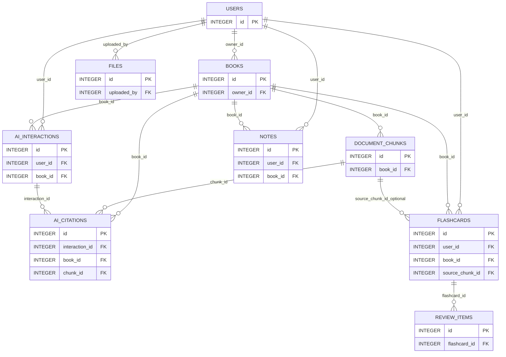

# Smart Reader DB Relationship Map

Last updated: 2026-06-02
Database: `backend/smart_reader.db` (SQLite)

## Tables
- `users`
- `books`
- `files`
- `document_chunks`
- `ai_interactions`
- `ai_citations`
- `notes`
- `flashcards`
- `review_items`
- `alembic_version` (migration metadata)

## Entity Relationship Diagram (High-Level)

## Foreign Key Detail (from live DB)

### `ai_citations`
- `chunk_id -> document_chunks.id` (on_delete=CASCADE)
- `book_id -> books.id` (on_delete=CASCADE)
- `interaction_id -> ai_interactions.id` (on_delete=CASCADE)

### `ai_interactions`
- `user_id -> users.id` (on_delete=CASCADE)
- `book_id -> books.id` (on_delete=CASCADE)

### `books`
- `owner_id -> users.id` (on_delete=NO ACTION)

### `document_chunks`
- `book_id -> books.id` (on_delete=CASCADE)

### `files`
- `uploaded_by -> users.id` (on_delete=NO ACTION)

### `flashcards`
- `user_id -> users.id` (on_delete=NO ACTION)
- `source_chunk_id -> document_chunks.id` (on_delete=NO ACTION)
- `book_id -> books.id` (on_delete=NO ACTION)

### `notes`
- `user_id -> users.id` (on_delete=NO ACTION)
- `book_id -> books.id` (on_delete=NO ACTION)

### `review_items`
- `flashcard_id -> flashcards.id` (on_delete=NO ACTION)

## Notes
- `WeeklyTrendPoint` is an API response schema in `backend/app/schemas.py`, not a physical DB table.
- `alembic_version` is used only for migration version tracking.
